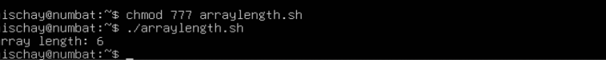

# LAB2.md
## 2.Script: ifelse.sh

### code 

#

## 3.Script:array_length.sh

### Purpose
-This script loops through an array of names and prints each one.
### code 

### line-by-line explanation
1.#!/bin/bash → Uses Bash shell to run the script.

2.# Script to demonstrate array and loop → Comment.

3.names=("abhay" "pratap" "singh") → Declares an array with three elements.

4.for name in "${names[@]}" → Loops through all elements of the array, assigning each one to name.

5.do → Start of loop body.

6.echo "Hello, $name!" → Prints a greeting for each array element.

7.done → End of loop"

ques1-How do you make a script executable?

chmod +x enhanced_numbers.sh

